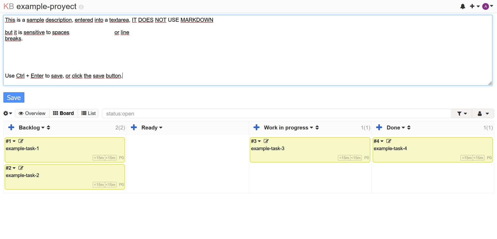

Description above board
==============================

This project is a plugin for the [Kanboard](https://kanboard.org/) project.

It displays the project's description above the task board and allows for editing directly from there.

**The panel will only be activated if a description is set.**

Author
------

- borrageiros
- License MIT

Requirements
------------

- Kanboard >= 1.0.35

Installation
------------

You have the choice between 2 methods:

1. Download the zip file and decompress everything under the directory `plugins/DescriptionAboveBoard`
2. Clone this repository into the folder `plugins/DescriptionAboveBoard`

Note: Plugin folder is case-sensitive.